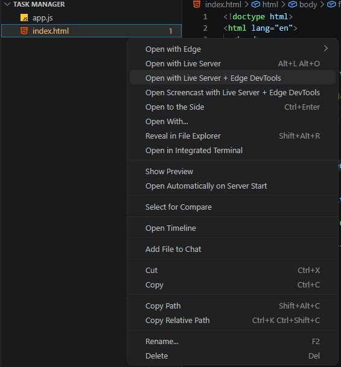
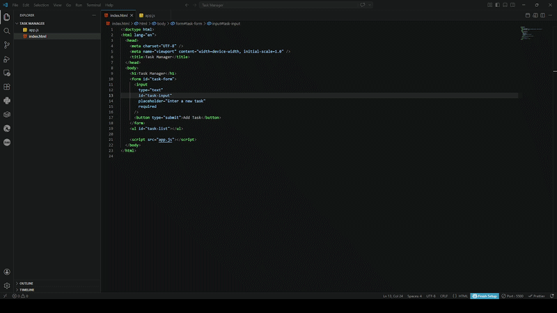

# Live Edge DevTools

Open any HTML file with **Live Server** + **Microsoft Edge DevTools** — so your page loads at `http://localhost:PORT/...` instead of `file://`, with full DevTools support right inside VS Code.

## Requirements

Both of these extensions must be installed:

- [Microsoft Edge Tools for VS Code](https://marketplace.visualstudio.com/items?itemName=ms-edgedevtools.vscode-edge-devtools) (`ms-edgedevtools.vscode-edge-devtools`)
- [Live Server](https://marketplace.visualstudio.com/items?itemName=ritwickdey.liveserver) (`ritwickdey.liveserver`)

## Usage

**Right-click any `.html` file** in the Explorer or editor and choose:

- **Open with Live Server + Edge DevTools** — opens Edge DevTools panel at `http://localhost:<port>/your-file.html`
- **Open Screencast with Live Server + Edge DevTools** — same but opens the Screencast (mobile/device emulation) panel



The extension will:
1. Start Live Server automatically (if it isn't running already)
2. Wait until the server is ready
3. Open Edge DevTools pointed at `http://localhost:<port>/your-file.html`



## Settings

| Setting | Default | Description |
|---|---|---|
| `liveEdgeDevtools.liveServerPort` | `0` | Override the Live Server port. Set to `0` to auto-read from Live Server's own settings (recommended). |
| `liveEdgeDevtools.startLiveServerDelay` | `1500` | Milliseconds to wait after starting Live Server before connecting. Increase if Edge connects too fast. |
| `liveEdgeDevtools.openMode` | `devtools` | `devtools`, `screencast`, or `ask` — determines which panel opens. |

## How it works

This extension is a thin orchestrator:

1. Reads the Live Server port from `liveServer.settings.port` (or your override)
2. Computes the `http://localhost:<port>/relative/path/to/file.html` URL from the file's workspace-relative path
3. Calls `extension.liveServer.goOnline` to start Live Server
4. Polls `localhost:<port>` until the server responds
5. Calls `vscode-edge-devtools.launch` with `{ launchUrl }` — exactly the same as if you typed the URL in manually

## Building from source

```bash
npm install
npm run compile
# or to watch:
npm run watch
```

To package as a `.vsix`:
```bash
npm run package
```
